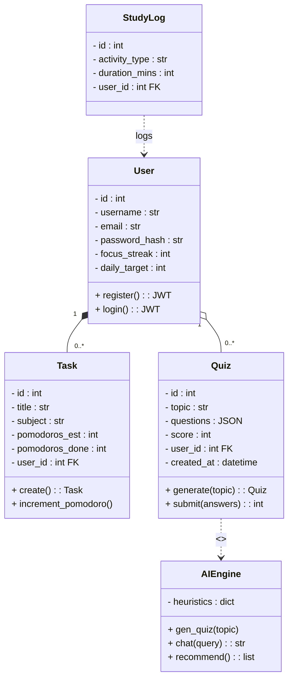
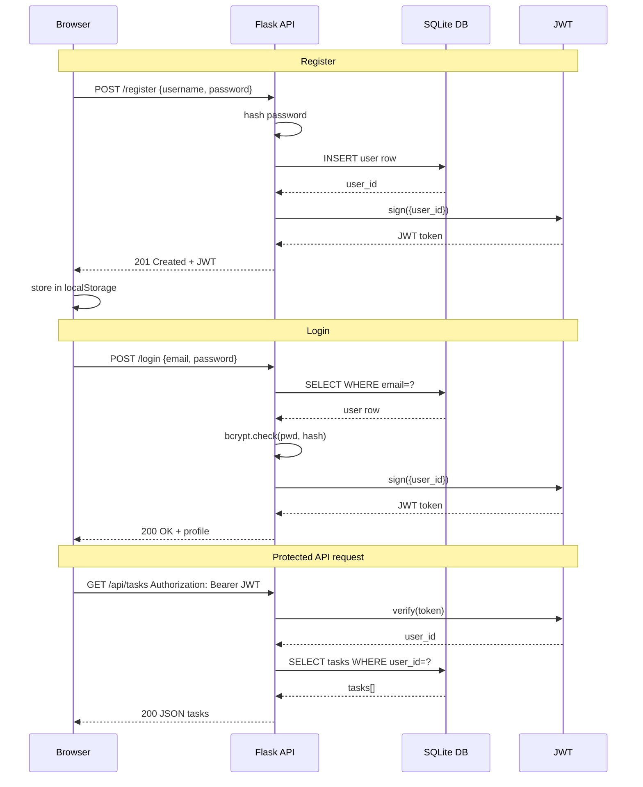
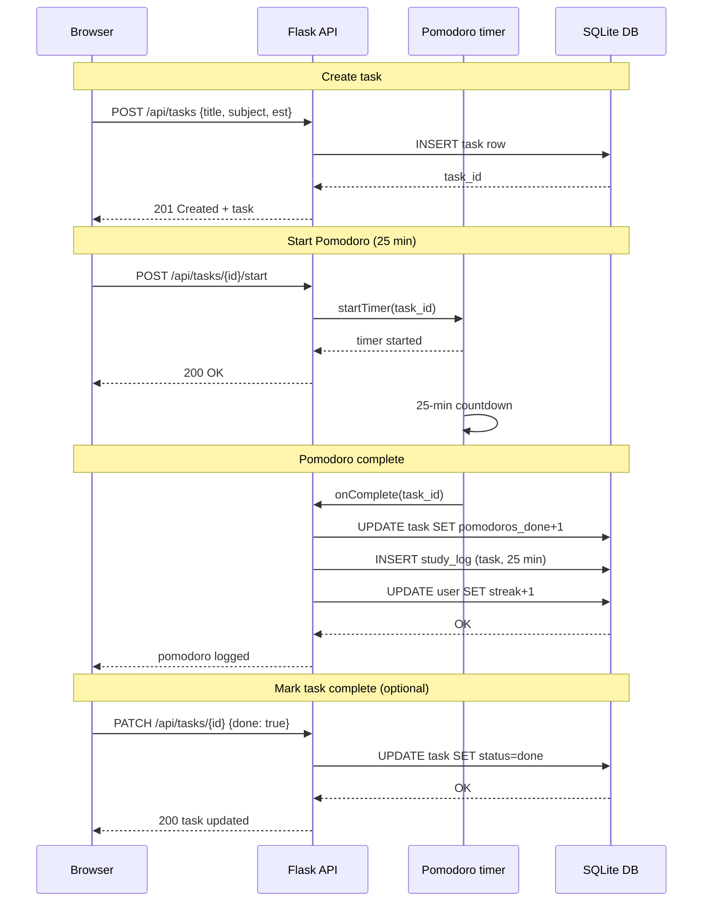
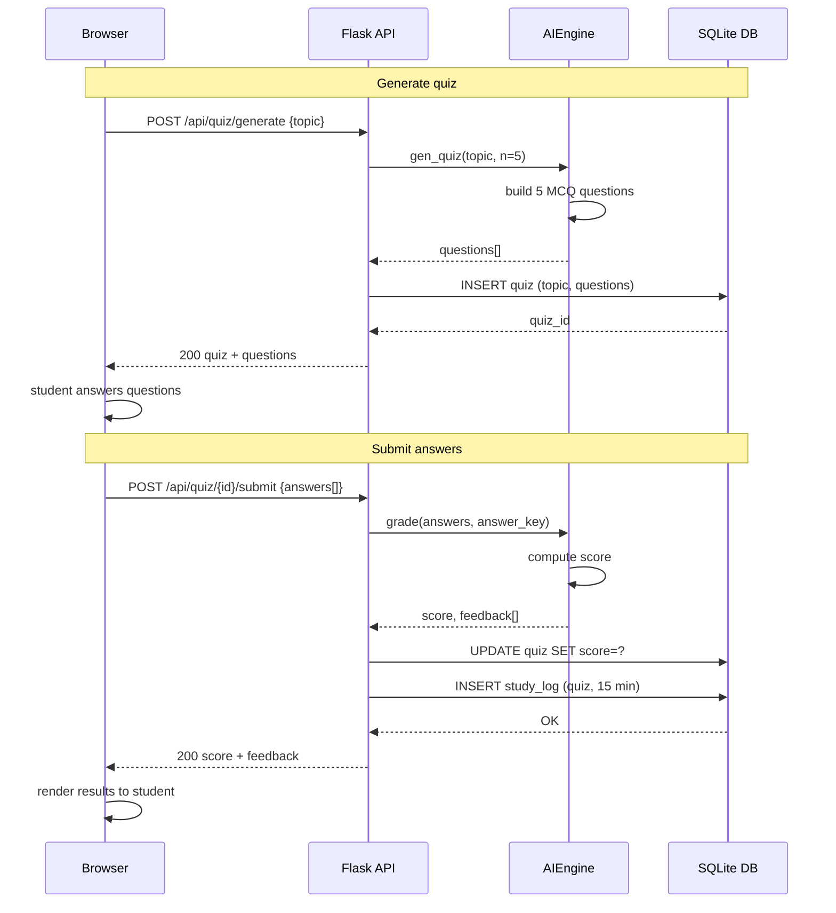
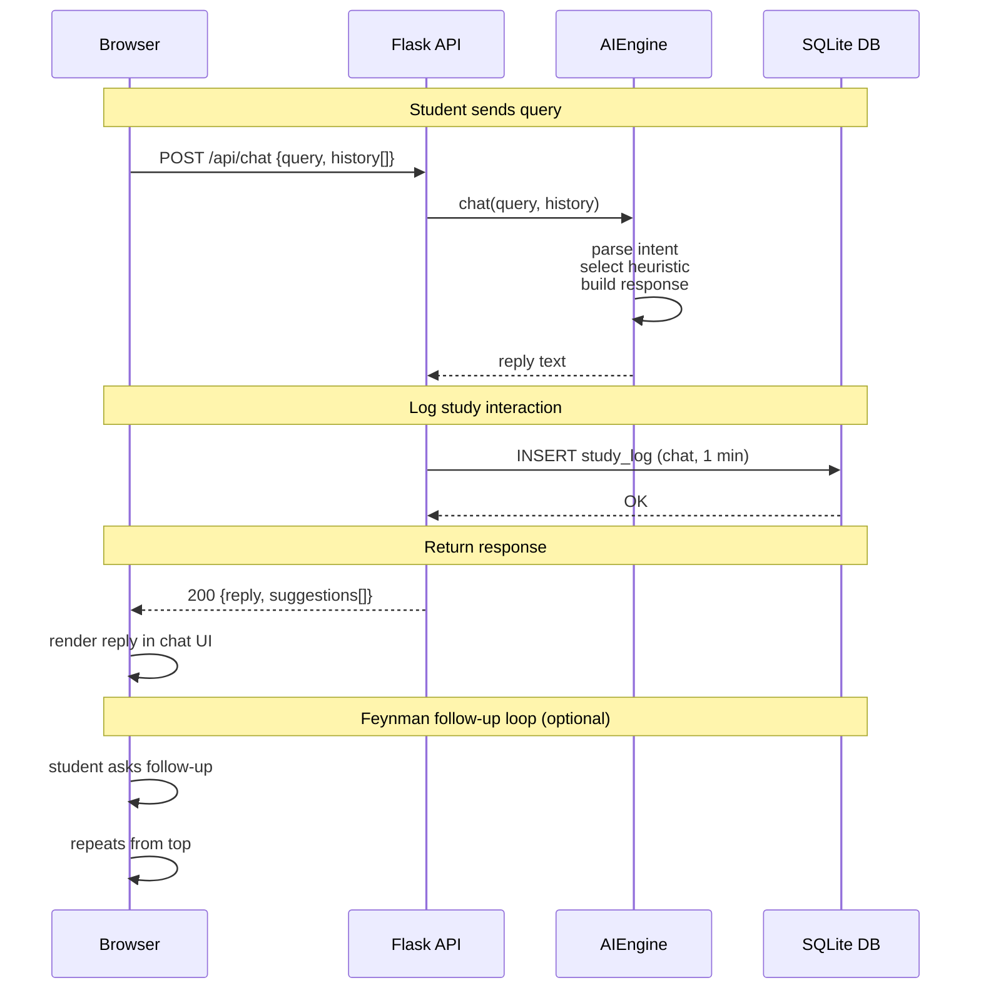

# System Architecture Diagrams

## Class Diagram

## Authentication Sequence Diagram

## Pomodoro Workflow Sequence Diagram

## Quiz Workflow Sequence Diagram

## AI Chat Workflow Sequence Diagram

